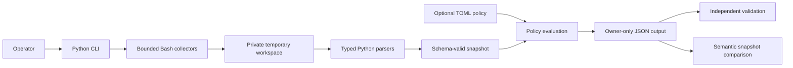

```text
███████╗██╗     ███████╗███████╗████████╗     █████╗ ██╗   ██╗██████╗ ██╗████████╗
██╔════╝██║     ██╔════╝██╔════╝╚══██╔══╝    ██╔══██╗██║   ██║██╔══██╗██║╚══██╔══╝
█████╗  ██║     █████╗  █████╗     ██║       ███████║██║   ██║██║  ██║██║   ██║
██╔══╝  ██║     ██╔══╝  ██╔══╝     ██║       ██╔══██║██║   ██║██║  ██║██║   ██║
██║     ███████╗███████╗███████╗   ██║       ██║  ██║╚██████╔╝██████╔╝██║   ██║
╚═╝     ╚══════╝╚══════╝╚══════╝   ╚═╝       ╚═╝  ╚═╝ ╚═════╝ ╚═════╝ ╚═╝   ╚═╝
```

# Fleet Audit

Fleet Audit is a local, read-only command-line tool for collecting privacy-conscious Linux inventory, evaluating simple operational policies and comparing snapshots for material change. It is intended for small IT teams that need reproducible evidence without deploying an agent or central service.

Version `0.1.1` is an alpha release. It is suitable for evaluation and portfolio demonstrations, not as evidence of production compliance or complete fleet coverage.

## What it does

- Collects operating system, hardware, storage, network exposure, package, service and maintenance facts.
- Writes a versioned JSON snapshot with explicit capability and failure information.
- Evaluates TOML policies for filesystem use, pending updates, uptime, required services and prohibited ports.
- Validates snapshots against the packaged JSON Schema.
- Compares two snapshots semantically, excluding volatile collection metadata from the material-change count.
- Omits hostnames, usernames, IP addresses, MAC addresses and machine identifiers from the schema.

Collection runs locally, without root privileges, `sudo`, remediation or network requests.

## Architecture and data flow



Shell collectors run fixed read-only commands and emit bounded intermediate files.
Python parsers normalise those files, record missing capabilities and validate the
complete document before exclusive publication. Policy checks annotate evidence;
they never alter the host.

## Requirements

- Linux using the APT/dpkg package stack
- Python 3.11 or later
- Bash 5 or later

The collection paths target Ubuntu 22.04 and 24.04, with Debian 12 as a secondary target. See [Platform limits](#platform-limits) before relying on a live collection.

## Install

Install the tagged release with `pipx`:

```bash
pipx install "git+https://github.com/ericjaytech/fleet-audit.git@v0.1.1"
fleet-audit --version
```

For development, clone the repository and install it into a virtual environment:

```bash
git clone https://github.com/ericjaytech/fleet-audit.git
cd fleet-audit
python3 -m venv .venv
. .venv/bin/activate
python -m pip install .
fleet-audit --version
```

For development, install the test and build tools:

```bash
python -m pip install -e '.[dev]'
```

## Quick start

Collect a local snapshot using a non-sensitive label:

```bash
fleet-audit collect --label lab-web-01 --output snapshot.json
```

Exercise the same collection, policy and schema-validation path without creating
a snapshot:

```bash
fleet-audit collect --label lab-web-01 --dry-run
```

```text
Dry run complete: 5 capabilities available, 0 unavailable, 2 warnings. No snapshot was written.
```

The command refuses to overwrite an existing output file. The snapshot is created with owner-only permissions and can be checked independently:

```bash
fleet-audit validate snapshot.json
```

To evaluate operational checks during collection, use the example policy:

```bash
fleet-audit collect \
  --label lab-web-01 \
  --policy config/example-policy.toml \
  --output assessed-snapshot.json
```

The policy format is TOML. Each `[[checks]]` entry has a stable identifier, a supported check type and type-specific thresholds. Review [config/example-policy.toml](config/example-policy.toml) for all five supported types.

## Compare snapshots

Compare a baseline with a later snapshot:

```bash
fleet-audit compare baseline.json current.json
```

Use JSON output for automation:

```bash
fleet-audit compare baseline.json current.json --format json
```

By default, a valid comparison exits successfully whether changes exist or not. To make material change fail a CI step:

```bash
fleet-audit compare baseline.json current.json --fail-on changed
```

Snapshots must have the same host label. Use `--allow-host-label-mismatch` only when comparing differently labelled records is deliberate.

## Offline demonstration

The repository includes synthetic snapshots. They exercise the complete validation and comparison path without collecting data from the current machine:

```bash
fleet-audit validate tests/fixtures/snapshots/complete.json
fleet-audit validate tests/fixtures/snapshots/changed.json
fleet-audit compare \
  tests/fixtures/snapshots/complete.json \
  tests/fixtures/snapshots/changed.json
```

The final command reports 13 material changes across the kernel, packages, services, ports, maintenance state, policy checks and collection capabilities. The names and values are invented for testing; they do not represent an employer, client or production system.

Example terminal output:

```text
Snapshot comparison: changed (13 material changes)
Baseline: "demo-web-01" at 2026-08-29T12:00:00Z
Current: "demo-web-01" at 2026-08-30T12:00:00Z
- [platform] changed "kernel": "6.8.0-example-generic" -> "6.9.0-example-generic"
- [packages] added "curl:amd64": null -> "8.5-example"
- [services] added "nginx.service": null -> "enabled"
- [ports] changed "tcp/22": ["external"] -> ["loopback"]
- [software] changed "reboot_required": false -> true
```

## Exit codes

| Code | Meaning |
| ---: | --- |
| `0` | The command completed and no requested failure condition was met. |
| `1` | `compare --fail-on changed` detected one or more material changes. |
| `2` | The command, policy or snapshot input was invalid or incompatible. |
| `3` | Collection could not complete safely. |

Unavailable optional capabilities do not automatically fail collection. They are recorded explicitly so missing evidence is not presented as a pass.

## Privacy and security

Snapshots intentionally include package, service, interface and mount-point names because they are required for useful inventory and drift detection. Those values can still reveal a system's purpose. Inspect every snapshot before publishing it.

The schema excludes direct host and user identifiers and rejects unknown fields. Collectors use fixed, read-only commands, a private temporary workspace and bounded subprocess output. See [Privacy and security](docs/privacy-and-security.md) for the exact data boundary and failure semantics.

## Platform limits

Disposable minimal-container checks have verified OS userland collection and graceful degradation on Ubuntu 22.04, Ubuntu 24.04 and Debian 12. Minimal containers did not provide every normal host utility, including `ip`, `ss` and a working systemd service manager.

The current evidence therefore does not qualify the full network and service collection paths on representative systemd hosts. Pending-update counts use the machine's existing package index; Fleet Audit never refreshes it. The tool is not a vulnerability scanner, compliance certification system, configuration management database or remediation service.

Output is deliberately limited to terminal text and versioned JSON. The project
does not include an HTML dashboard. Operators remain responsible for snapshot
retention, access control and deciding whether the collected names are safe to
share.

## Development checks

Run the same local gates used by continuous integration:

```bash
python -m ruff format --check .
python -m ruff check .
python -m pytest
shellcheck --external-sources --source-path=src/fleet_audit/collectors \
  src/fleet_audit/collectors/*.sh
shfmt --diff --indent 4 src/fleet_audit/collectors/*.sh
bats tests/bats
python -m build
```

Continuous integration tests Python 3.11 and 3.14 and runs the Python and shell quality gates on Ubuntu.
